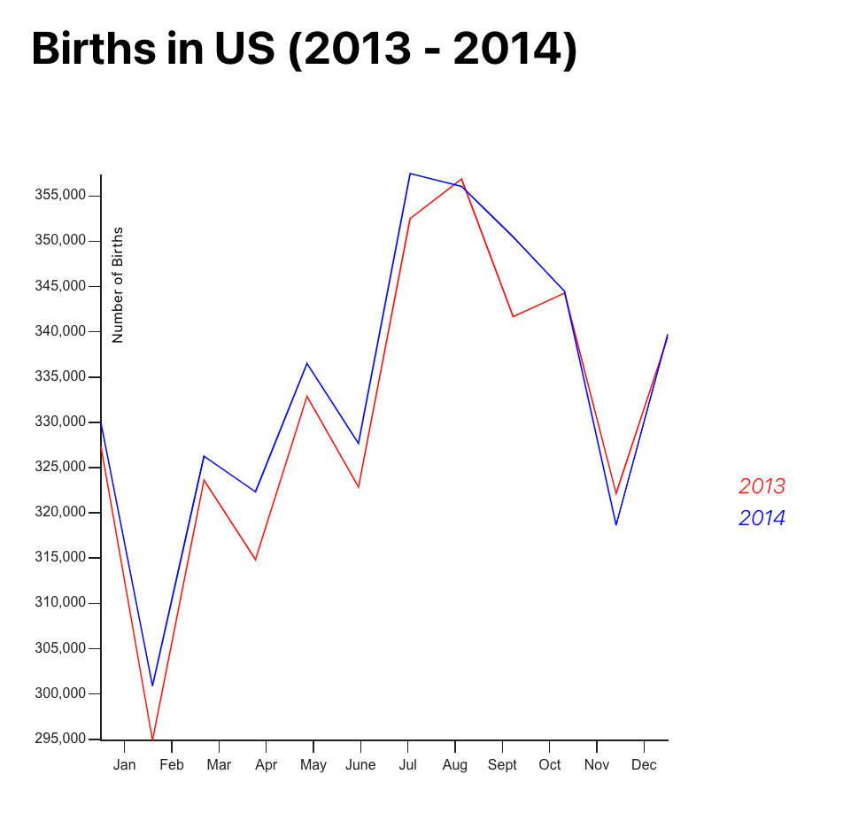

This visualization represents the total number of US births each month in the years of 2013 and 2014, as provided by the Social Security Administration. The purpose of this visualization is to show the difference in birth rate for both of the years. Not only does it show a yearly change but it also displays the monthly change during each year. It is crucial to monitor birth rates as they rise and fall and measure these trends to track important changes and what they may mean for our society's future. The graph is displayed as a line graph with the red line representing the year, 2013, and the blue line representing the year, 2014, according to the legend. The reason why a line plot was chosen for this visualization is because they are used to track changes over short and long periods of time. Especially when there are smaller changes, such as during the month as opposed to yearly changes, line graphs are optimal. A bar graph could have also been used but because we mainly want to analyze the change in birth rates over time, a line graph was considered to be the most useful. I decided to put months on the x-axis and then the number of births on the y-axis because, again, we are analyzing the birth rates over time, which is y over x. Choosing the right plot is important to help convery the right message to our audience. It also helps us to find outliers in our data, which in this case would be a sudden spike or decrease in the overall birth rates. 
